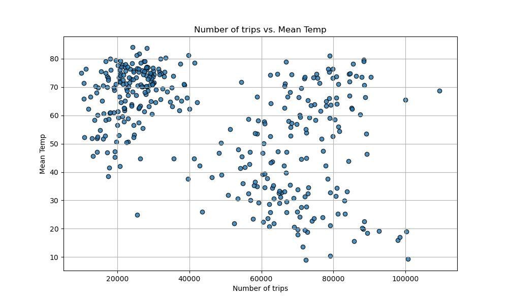

# Uber Ride Patterns in Extreme Weather

### **Table of Contents:**
* [Project Description](https://github.com/Barbsbhg/Group1_Project1/edit/main/README.md#project-description)
* [Dataset](https://github.com/Barbsbhg/Group1_Project1/edit/main/README.md#project-description)
* [Research Questions](https://github.com/Barbsbhg/Group1_Project1/edit/main/README.md#project-description)
* [Hypothesis](https://github.com/Barbsbhg/Group1_Project1/edit/main/README.md#project-description)
* [Data Analysis](https://github.com/Barbsbhg/Group1_Project1/edit/main/README.md#project-description)
* [Interpretation & Recommendations](https://github.com/Barbsbhg/Group1_Project1/edit/main/README.md#group-1-team-members)
* [Project Limitations](https://github.com/Barbsbhg/Group1_Project1/edit/main/README.md#project-description)
* [Conclusion](https://github.com/Barbsbhg/Group1_Project1/edit/main/README.md#dataset)

### **Group 1 Team Members:**
* Barbie Hurtado
* Nathan Farley
* Brian Paniagua
* Walaa Youssef

### **Project Description:**
The aim of this project is to analyze the relationship between weather conditions and Uber ride
usage, especially during extreme weather conditions. The problem we address is whether weather conditions, ranging from subzero temperatures to scorching heat, influence the frequency of ride-sharing usage. 
* Compare the Uber rides vs the weather in New York City
* Compare the following data:
  * Ride demand 
  * Weather conditions
  * Geographic distribution

### **Dataset:**
We used the following data for our analysis:
* [Historical weather data](https://home.openweathermap.org/history_bulks)
  * Parameters:
    * Dates: January 2014 - December 2015
    * Location: New York City
    * Units: Imperial
    * Weather data:
      * Temperature
      * Max & min temperature
      * Feels like
      * Humidity
      * Clouds
      * Pressure
      * Weather conditions
      * Rain
      * Snow
      * Dew point
      * Visibility
      * Wind

* [Uber pickups in New York City](https://www.kaggle.com/datasets/fivethirtyeight/uber-pickups-in-new-york-city?resource=download&select=Uber-Jan-Feb-FOIL.csv)

### **Research Questions:**
1. **Correlation Study:** Is there a specific correlation between weather factors (e.g., temperature, precipitation) and the number of rides provided by Uber and other FHV companies?\
    * **Demand Impact:** How does weather influence ride demand for Uber and other FHV (For-Hire Vehicles) companies in New York?\
    * **Strategic Planning:** Can correlations between weather and ride frequency be leveraged to plan driver promotions and increase ride shares?

### **Hypothesis:**
**Hypothesis:** Extreme weather conditions significantly affect the demand and geographic distribution of rides for Uber and other FHV companies.\
**Null Hypothesis:** Extreme weather conditions do not significantly impact the demand and geographic distribution of rides for Uber and other FHV companies.

## **Data Analysis:**

### **Interpretation & Recommendations:**
The most prominent relationship is between temperature and the number of trips. As temperatures rise, the number of trips tend to decrease. This could be due to people choosing alternative modes of transportation, walking, or avoiding outings during hot days. Humidity and cloudiness also show relationships with the number of trips, but these correlations are weaker, suggesting other factors might be at play.

#### **Given this correlation data, Uber and other FHV companies might want to:**
**Promote Services on Colder Days:** Since there is a negative correlation between temperature and the number of trips, it may be strategic to offer promotions or discounts during colder days to incentivize more users.\
**Optimize Fleet Deployment:** Knowing that there are fewer trips on hotter days, companies can optimize the number of drivers on the road during such conditions.\
**Consider Humidity and Cloudiness:** While the correlations here are weaker, these weather parameters still influence ride demand. It might be worth delving deeper to understand if there are specific thresholds where humidity or cloudiness dramatically affects trip numbers.

### **Project Limitations:**
* Absence of an accessible API for the required data, leaving us reliant on the sole available dataset at our disposal.
* Within our Uber data, a noticeable gap emerges from April to September 2014, followed by a leap to January to June 2015, causing the omission of the entire Fall season.
* Our dataset was confined solely to NYC, preventing us from accessing data from all boroughs.
* The project's timeframe was restricted to class hours only, due to the demanding professional commitments of all team members.

### **Conclusion:**
The hypothesis that extreme weather conditions significantly affect the demand of rides for Uber and other FHV companies was proven by this analysis. 

